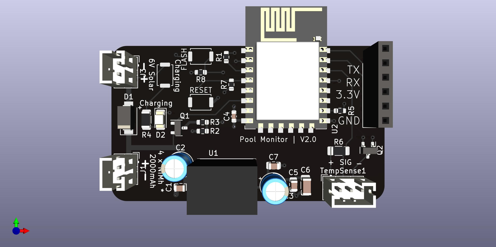

# PoolMonitor


<!-- @import "[TOC]" {cmd="toc" depthFrom=1 depthTo=6 orderedList=false} -->

<!-- code_chunk_output -->

- [PoolMonitor](#poolmonitor)
  - [Description](#description)
  - [Hardware](#hardware)
    - [PCB Manufacturing](#pcb-manufacturing)
    - [Parts](#parts)
    - [Sensor](#sensor)
    - [Jumpers](#jumpers)
      - [Disable pol prot](#disable-pol-prot)
      - [Disable power ctrl](#disable-power-ctrl)
  - [Installation of software](#installation-of-software)
  - [Home Assistant configuration](#home-assistant-configuration)

<!-- /code_chunk_output -->


## Description
This is a small PCB made to monitor the temperature of a pool using a DS18B20 waterproof sensor. The PCB is based around a ESP-12 module that will connect to WiFi periodically (period time configurable) and report the temperature together with battery voltage via MQTT. In between the meassurements, the sensors are turned off to save battery.



## Hardware
### PCB Manufacturing
I had the board manufactured at [JLCPCB](https://jlcpcb.com/). Simply upload the ZIP-file in the `PCB/gerbers` directory to their website. The following PCB stackup is used:
|Layer|Name|
|---|---|
|L1(Top Layer)|PoolMonitor-F_Cu.gtl|
|L2(Inner Layer1)|PoolMonitor-GND.g2|
|L3(Inner Layer2)|PoolMonitor-3_3V.g3|
|L4(Bottom Layer)|PoolMonitor-B_Cu.gbl|

### Parts
A BOM for the project is available in the file `PCB/PoolMonitor.csv`. The parts list have references to [LCSC](https://lcsc.com/) part numbers.

### Sensor
This board is designed to use a simple DS18B20 sensor with three wires. The following wiring diagram is to be used and the sensor should be connected to the `TempSense1` connector.
|Wire Color|Connection|
|---|---|
|Red|+|
|Black|-|
|Yellow|D|

### Jumpers
#### Disable pol prot
This jumber, when briged, will disable the polarity protection on the power input.
#### Disable power ctrl
This jumber will, when briged, disable to power control of the DS18B20 sensor when not reading from it. By default the power to the DS18B20 sensor will only be turned on while reading data from it in an attempt to conserve power.

## Installation of software
1. Connect a FTDI programmer set to 3.3V to the header on the PCB.
2. Download and installation VS Code together with the PlatformIO extention.
3. Download this repo and open it with PlatformIO.
4. Hold the SW_FLASH1 button and press and release the SW_RESET1 button. This will put the device into a programming mode.
5. Create a copy of the "settings.h.example" file found in the "src/" directory and name it `settings.h`.
6. Configure all relevant paramaters in the `settings.h` file.
7. Make sure to save everything and then press "Upload" in PlatformIO.
8. Once the upload is complete, disconnect the FTDI-programmer.
9. Done, enjoy.

## Home Assistant configuration
The following configuration example can be added to the `sensor` section in your Home Assistant configuration. The `expire_after` paramater set to 4200 means that Home Assistant will consider the value old if 70 minutes has passed since last update from sensor. This value may need to be changed in order to reflect your configuration of the `SLEEP_TIME` paramater in the `settings.h` file.
```yaml
- platform: mqtt
  device_class: temperature
  name: "Pool temperature"
  state_topic: "/pool/temp/"
  unit_of_measurement: "°C"
  expire_after: 4200
- platform: mqtt
  device_class: temperature
  name: "Pool sensor voltage"
  state_topic: "/pool/voltage/"
  unit_of_measurement: "V"
  expire_after: 4200
```